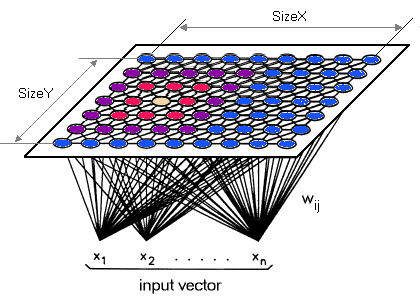

# Machine Learning là cái gì?

Để tránh làm như giáo viên dạy văn, tôi sẽ không nói tất tần tật về machine learning \(ML\), mà thay vào đó, ta sẽ bắt đầu bằng ví dụ.

Có bao giờ bạn tự nghĩ tại sao các cụ ngày xưa có mấy câu tục ngữ như _"trăng quầng thì hạn, trăng tán thì mưa"_ hay _"chuồn chuồn bay thấp thì mưa"_ không? Hay là tự hỏi tại sao Facebook biết trong ảnh có người yêu cũ \(nyc, xin lỗi vì chạm vào nỗi đau của bạn\) của bạn mà gợi ý bạn tag nó vào?

Trong câu hỏi đầu tiên có lẽ bạn đã biết được lý do rồi, là bởi vì người xưa quan sát thấy các hiện tượng đó lặp đi lặp lại, thế hệ này sang thế hệ khác dần dần đúc kết lại thành quy luật. Còn nhận dạng, bạn có thể hiểu theo cách tương tự là Facebook đã có nhiều ảnh sống ảo của nyc, việc nó cần làm là dùng những ảnh đó để rút ra đặc điểm và dựa trên đó để xác định có phải nyc hay không.

Bây giờ, ta sẽ phân tích ví dụ một chút, lấy luôn câu_"chuồn chuồn bay thấp thì mưa"_ . Ta thấy câu đó là một cặp **nguyên nhân - kết quả.** Nguyên nhân ở đây là _chuồn chuồn_, kết quả là _mưa_, và tất nhiên cần thêm điều kiện là _bay thấp_ nữa. Kể cả nhận dạng nyc cũng thuộc loại này. Trong toán học, chúng ta gọi nguyên nhân trên là điều kiện cần và điều kiện trên là điều kiện đủ. Nhưng khoan, làm sao Facebook có thể rút ra được những đặc điểm của nyc, khi nyc post ảnh nó có miêu tả nó đâu? Tôi có thể trả lời ngắn gọn cho bạn là nếu Facebook thấy body ba vòng như một của nyc của bạn đến phát ngán thì nó sẽ ấn tượng đến mức biết đó là đặc trưng của nyc bạn :\) bạn cứ suy luận tương tự với các bộ phận khác.

Thế chốt lại ML là cái gì? Thật sự có rất nhiều định nghĩa, nhưng theo tôi, _**ML là tập hợp các kỹ thuật tính toán dựa trên kinh nghiệm để dự đoán hoặc cải thiện độ chính xác.**_ Ví dụ, những lần quan sát hiện tượng hay những bức ảnh của nyc chính là kinh nghiệm để máy móc có thể dự đoán trời mưa hoặc để càng ngày biết càng rõ nyc trông như thế thế nào. Và hai ví dụ nêu trên chính là đại diện của hai nhánh lớn trong ML mà ta sắp tìm hiểu dưới đây.

## 1. Supervised learning \(học có hướng dẫn\) 

Đây chính là ví dụ chuồn chuồn. Ta quay lại với bộ ba nguyên nhân - điều kiện - kết quả dưới hình thức phương trình toán học:

$$
ketqua = dieukien(nguyennhan)\\
hay \ \ Y = f(X)
$$

$$X $$là đầu vào, là dữ liệu, là kinh nghiệm để máy học; $$Y$$ là đầu ra, là kết quả đã được mặc định với đầu vào đó; hàm $$f$$ là hàm biểu diễn mối quan hệ giữa hai ký tự trên, tưởng tượng nó giống như cái máy xay hạt cà phê thành bột ấy. Triết học một chút, nguyên nhân khi gặp một điều kiện sẽ sinh ra kết quả.

Nhiệm vụ của máy trong trường hợp này là tìm ra hàm $$f$$ đó, với độ chính xác cao nhất có thể \(bởi vì dữ liệu đời thật nó không có ngon như lý thuyết đâu\).

Tôi gọi đây là học có hướng dẫn thay vì gọi là học có giám sát như phần đông vì ta cho máy biết chính xác đầu ra và máy học dựa trên nó. Tất nhiên là cả hai cách gọi đều không sai. Học có hướng dẫn có thể chia ra 3 nhánh nhỏ nữa.

### 1.1 Regression \(hồi quy\)

Tôi thật sự cũng không hiểu rõ hai từ _"hồi quy"_ là gì, nhưng có vẻ nó là _quy_ \(dữ liệu\) _về_ một công thức nào đó. _**Mô hình hồi quy \(regression model\) mô tả mối liên hệ giữa một tập các biến dự đoán trong dữ liệu \(**_$$X$$ _**ở trên\) và một hay nhiều biến phụ thuộc \(đầu ra**_ $$Y$$_**\).**_ Mô hình hồi quy tổng quát như sau \(với $$\beta$$ là hệ số hồi quy\):

$$
Y = f(X, \beta)
$$

Hình trên là một mô hình hồi quy đơn giản nhất, bạn có thể thấy nó tìm ra một đường thẳng đi qua nhiều điểm dữ liệu nhất, tức tổng khoảng cách các điểm đến đường thẳng là nhỏ nhất. Mục đích cuối cùng của hồi quy là tìm ra \(một hoặc một tập\) hệ số $$\beta$$, dựa trên đó, ta có thể **dự đoán được các giá trị liên tục** \(trên tập số thực hoặc nguyên\) $$Y$$từ $$X$$. Một ứng dụng khác là ta có thể rút gọn dữ liệu bằng cách chỉ lưu lại hệ số hồi quy $$\beta$$ \(khi quan hệ trong dữ liệu cực đẹp\).

Thật sự có rất nhiều kiểu hồi quy, liệt kê sơ sơ ra gồm có tuyến tính, phi tuyến, đơn/đa biến, vô hạn thông số, bất/đối xứng,... Tất nhiên ta sẽ không tìm hiểu bây giờ, chẳng khác nào tự kết thúc tất cả.

### 1.2 Classification \(phân loại\)

Đây là kỹ thuật dự đoán khi đầu ra là các giá trị rời rạc. Có lẽ bạn đã bắt gặp dạng này ở nhiều nơi như tính năng chặn email rác; phân loại ảnh người, cây cối, xe cộ; phân loại chủ đề báo,... Đầu ra được gọi là nhãn \(label\) hoặc lớp \(class\) và thường số lượng các nhãn không đến một trăm loại.

Vài kiểu phân loại phổ biến:

* Naive Bayes: dựa trên xác suất.
* Support Vector Machine: tìm siêu phẳng với lề cực đại ngăn cách dữ liệu.
* Neural Network: tìm các trọng số thích hợp.
* Tree: tạo các luật if-else.
* K-Nearest Neighbors: dựa trên khoảng cách các mẫu dữ liệu.

### 1.3 Ranking \(xếp hạng\)

\(Cái này chắc mấy ông SEO trùm luôn\)  
Đơn giản chỉ là học cách xếp dữ liệu theo một điều kiện nào đó, thường thấy ở Google xếp hạng các kết quả tìm kiếm hay trong rút trích thông tin.

Cần lưu ý là Ranking khác với Classification:

## 2. Unsupervised learning \(học không có hướng dẫn\) 

Tất nhiên không có hướng dẫn là ta không cung cấp nhãn cho máy, và máy phải tìm ra mối quan hệ bên trong dữ liệu chứ không phải là đầu vào và đầu ra nữa \(có vẻ không giống học cho lắm\). Và ta có thể chia nó thành hai nhóm lớn:

### 2.1 Clustering \(gom cụm\)

Những dữ liệu nào có tính chất giống nhau sẽ được máy gom lại thành một cụm, và mỗi cụm này càng khác nhau càng tốt.

Ứng dụng của gom cụm thì rất nhiều, từ ảnh ọt cho đến bán hàng. Ví dụ dễ nhất là tìm các nhóm khách hàng có sở thích, điều kiện giống nhau để có chiến dịch quảng cáo phù hợp cho từng nhóm.

Có hai loại gom cụm là phân hoạch \(hình người trên\) và phân cấp \(hình người dưới\)

### 2.2 Dimensionality reduction / Manifold learning \(giảm chiều dữ liệu\)

Nói chung là dạng kỹ thuật này biến dữ liệu nhiều thuộc tính về ít thuộc tính hơn nhưng vẫn giữ nguyên các mối liên hệ gốc bên trong. Ví dụ nhá, bạn đặt các tiêu chuẩn để yêu một em là ngoan, hiền, thùy mị, nết na, đảm đang, giỏi giang; nhưng cuối cùng bạn vẫn sẽ yêu một đứa ngon chảy dãi hoặc bố nó làm to; vậy thì cần gì nhiều điều kiện vớ va vớ vẩn ở trên? Kết quả nó vẫn thế mà.

Nổi tiếng nhất trong dạng giảm chiều này là mạng Kohonen \(Self-organizing map\):

## Kết

Nếu bạn không hiểu hồi quy hay phân hoạch phân chó gì đó thì cũng đừng buồn, bởi vì tiêu đề bài viết chỉ là giới thiệu ML chứ không phải là giải thích những thứ bên trong nó. Vậy hen.

Contact the author:[ Facebook](https://fb.com/buiminhnhat.io), [Instagram](https://instagram.com/minhnhatio), [Twitter](https://twitter.com/minhnhatio)  
Email: minhnhat@linuxmail.org

